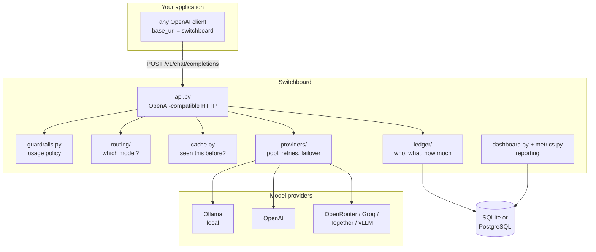
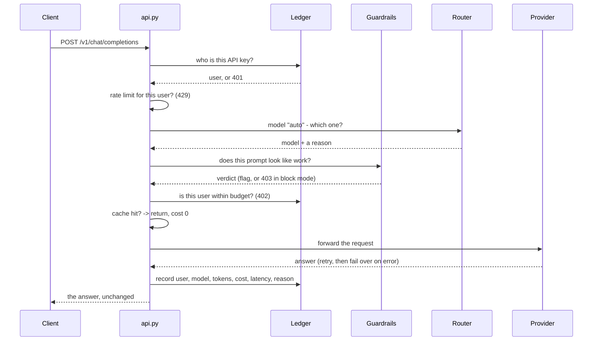
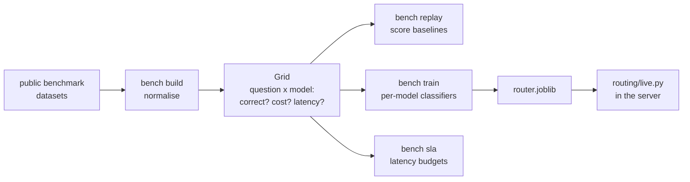

# How Switchboard is put together

This document explains the whole system in plain English: what each piece does,
why it exists, and what happens to one request from the moment it arrives.

If you only read one section, read [The request lifecycle](#the-request-lifecycle).

---

## The one-sentence version

Switchboard is a proxy that speaks the OpenAI API. Your application points at
it instead of at OpenAI; Switchboard decides which model should actually answer,
sends the request there, and writes down what happened.

---

## The shape of the system

Nothing above is a microservice. It is one Python process. The boxes are
modules, and they are separate modules because each one is a decision that can
be got wrong independently.

---

## The request lifecycle

This is the sequence every chat completion goes through. The order is chosen so
that **every possible refusal happens before any money is spent.**

Every one of the numbered failures is a normal OpenAI-shaped error body, so an
existing client surfaces it properly instead of crashing on an unexpected shape.

---

## The pieces, and why each exists

### `api.py` — the HTTP surface

Implements `POST /v1/chat/completions`, `GET /v1/models`, the health endpoints,
`/metrics` and `/dashboard`.

The important design decision: **the request body is not schema-validated.** It
is passed through to the provider as it arrived, and only the `model` field is
ever rewritten. Validating it would mean modelling every OpenAI feature — tools,
response formats, log probabilities, whatever ships next month — and any feature
not modelled would break. Passing it through means Switchboard stays compatible
with things it has never heard of.

Streaming is a genuine pass-through. The bytes go straight to the client while a
sniffer reads the token usage out of the stream as it passes, so accounting
happens without buffering the answer or delaying the first token.

### `catalog.py` — what models exist

Reads `providers.yaml`. Every model has a provider, a price per million tokens
in and out, a tier, and optionally a `benchmark_alias`.

Two decisions here matter:

**API keys are never in the config.** `providers.yaml` names an environment
variable (`api_key_env: OPENAI_API_KEY`); the key itself lives in `.env`, which
is gitignored. The config file is safe to commit, which is the only way a config
file ever stays correct.

**Two providers may declare the same model.** That is not a conflict — it is
failover. If Groq is down, the same model is served from OpenRouter.

### `routing/` — which model should answer

Three layers:

- `base.py` — the interface. A strategy takes a `RoutingContext` and returns a
  `RoutingDecision` with a model *and a reason*. The reason is mandatory because
  a routing decision you cannot explain afterwards is a routing decision you
  cannot debug.
- `baselines.py` — always-cheapest, always-best, random, keyword heuristic.
  These exist to be beaten. A clever router with no baselines beside it is an
  unsupported claim.
- `live.py` — loads a trained artifact and drives it in the live API, applying
  per-request limits sent as headers.

A missing, corrupt, or stale router artifact **never stops the server.** Routing
switches off, requests fall back to `default_model`, and `/health` says exactly
why. A routing feature that can take the gateway down is worse than no routing.

### `guardrails.py` — the usage policy

Notices when the company gateway is being used to plan somebody's holiday.

The design is shaped by one asymmetry: missing a personal request costs a
fraction of a cent, while wrongly blocking a real one stops an engineer working
at the moment they are trying to work. So:

- The default mode is **`flag`**, which refuses nothing. It writes a label to
  the ledger and serves the request normally.
- Technical content in the prompt (code fences, stack traces, SQL, file paths)
  **subtracts** from the score, so anything that looks like engineering needs a
  much stronger personal signal to trip.
- Rules have weights. A phrase that could only ever be personal counts 1.0 and
  trips on its own; a phrase that shows up in real tickets counts 0.5 and needs
  a second signal.
- `block` mode exists, and it ships with an override header, and the refusal
  message tells you about it. A false positive should cost five seconds, not a
  support ticket.
- Only the verdict and the names of the matched rules are stored — never the
  prompt text. A feature built to police what people type must not become the
  reason a company starts recording what people type.
- `switchboard guardrails calibrate` reports its own false-positive rate,
  including the exact prompts it got wrong.

### `cache.py` — never pay twice for the same question

An in-memory LRU with a TTL. A cache hit costs nothing, and the ledger records
it as costing nothing — a hit billed at full price would inflate every savings
figure in the product.

Only *byte-identical, deterministic* requests hit. Semantic matching is
deliberately not implemented: a cache that occasionally returns a confident
answer to a question nobody asked is worse than no cache.

### `providers/` — talking to models

- `openai_compatible.py` — one adapter, because every provider worth supporting
  speaks this dialect.
- `pool.py` — holds the clients, knows which providers can serve a model, and
  enforces `LOCAL_ONLY`.
- `retry.py` — exponential backoff with jitter, for *transient* failures only
  (timeouts, 429, 5xx). A malformed request is never retried: it would fail
  identically and cost twice.
- `breaker.py` — a circuit breaker. After N consecutive failures a provider is
  skipped for a cooldown, then probed. Without this, every request to a dead
  provider waits out its full timeout before failing over.

Failover rule: a provider that raises or returns 5xx is a failure, and the next
provider is tried. **A 4xx is not a failover** — the request itself is wrong and
every other provider would reject it identically, so retrying elsewhere just
multiplies the cost of one bad request by the number of providers configured.

### `ledger/` — who spent what

Two tables. `users` holds names, hashed API keys, budgets and rate limits.
`requests` holds one row per request: user, requested model, served model,
tokens, simulated cost, baseline cost, latency, status, routing reason, shadow
decision, and policy verdict.

The **baseline cost** column is what makes the savings claim auditable. Every
row stores what that same request would have cost on the top-tier model, so
"we saved 57%" is a `SELECT`, not a reconstruction from assumptions.

Only the hash of an API key is stored. The raw key exists once, at creation, and
is never recoverable.

Timestamps are naive UTC everywhere, because SQLite does not preserve timezone
information and carrying tz-aware values through it invites comparison bugs that
surface months later.

### `shadow.py` — trying routing without risking anything

Runs the router on every request, records what it *would* have chosen and what
that would have cost — then ignores the decision and serves the request exactly
as it would have been served with no router at all.

After a week of real traffic an operator has a report about their own workload,
having risked nothing. Two limits are stated everywhere the numbers appear: the
shadow cost is an estimate (that model was never called, so its token count does
not exist), and shadow mode cannot say whether quality would have held up (no
answer was produced to grade).

### `dashboard.py` and `metrics.py` — reporting

`/dashboard` is server-rendered HTML with inline CSS. No JavaScript, no build
step, no CDN. It has to work on a machine with no internet — the deployment
`LOCAL_ONLY` exists to support — and nothing loaded from a CDN should get to see
when your engineers look at their AI spend.

`/metrics` is the Prometheus text format, written by hand rather than pulling in
a client library. The rule that matters there is **cardinality**: labels are only
ever drawn from small fixed sets (a status, a provider, a model). Labelling by
user or by prompt would create a new time series per user or per request and
eventually take the monitoring system down.

### `migrations/` — changing the schema without losing data

Alembic, five revisions. The server **refuses to start** against a database
whose schema does not match the code. Starting anyway does not fail cleanly; it
fails later, mid-request, with an error pointing somewhere unhelpful.

---

## The research half

Everything under `eval/` is offline analysis. It is **not** in the Docker image
and is not needed to run the gateway.

The whole trick is that these datasets contain **recorded answers from real
commercial models**. Once normalised into a grid of question × model → (correct,
cost, latency), any routing strategy can be scored exactly, offline, with zero
API calls and zero spend. That is what made it possible to evaluate against
GPT-5, Claude and Gemini without a budget.

Held-out splits are by question, never by row, so the same question cannot
appear in training and test under two different models.

---

## Design rules that show up everywhere

**Safe by default, useful on request.** Prompt storage is off. Blocking is off.
`LOCAL_ONLY` exists. Nobody should acquire a legal liability by installing
software and leaving the defaults alone.

**Never flatter the numbers.** Cache hits cost zero. Cascades are charged for
every call they make. Budget-blocked requests cost zero. Shadow projections are
labelled as projections. Each of these is a place where the self-serving version
of the accounting would have looked better.

**A degraded feature must not take the service down.** No router: fall back and
say so. Provider down: fail over. Stale artifact: routing off, `/health`
explains. The one exception is a broken *policy* file, which is fatal at startup
— a policy an operator believes is running must never be silently off.

**Every decision records its reason.** `routing_reason`, `guardrail_rules`,
`X-Switchboard-Cache`, the circuit-breaker snapshot in `/health`. A gateway you
cannot interrogate after the fact is a gateway nobody will trust with production
traffic.

---

## Where the numbers are

See [RESULTS.md](RESULTS.md) for every measured figure, how it was produced, and
what it does not prove.
