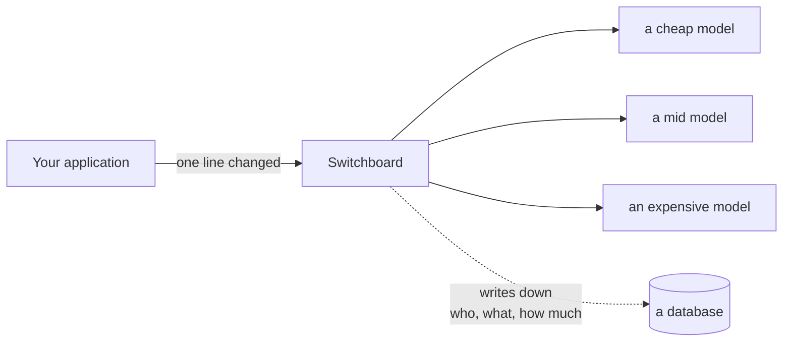
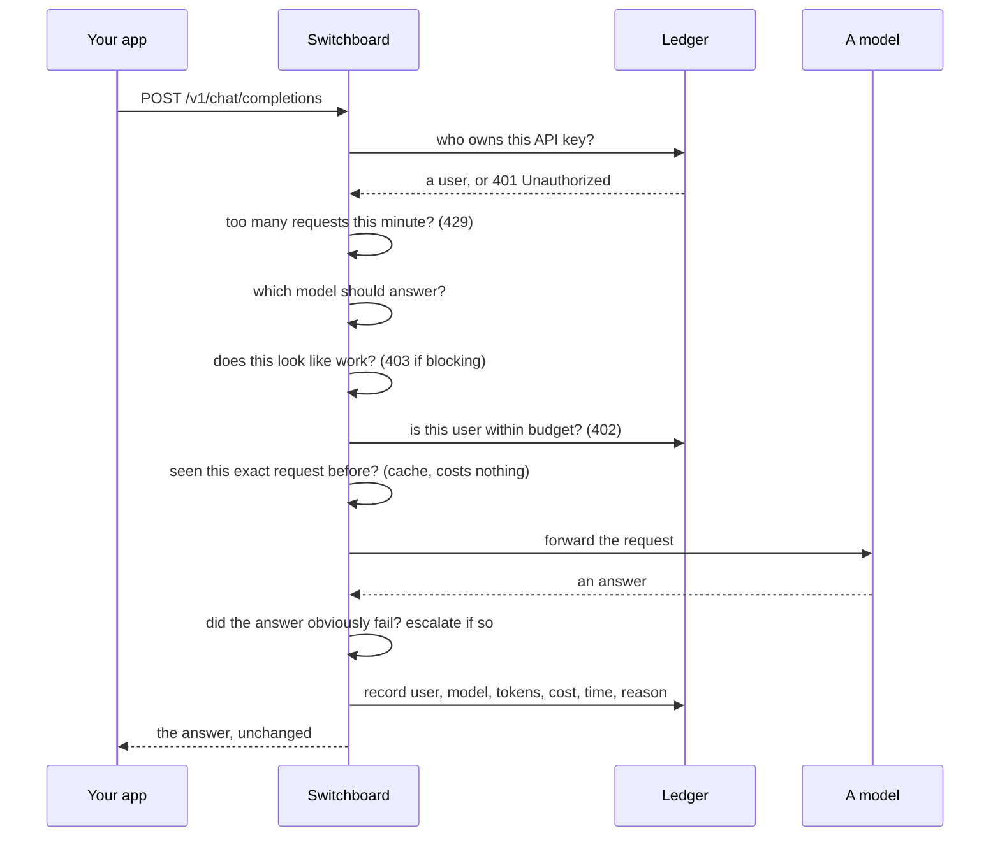
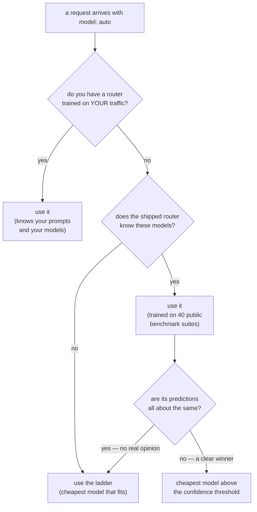
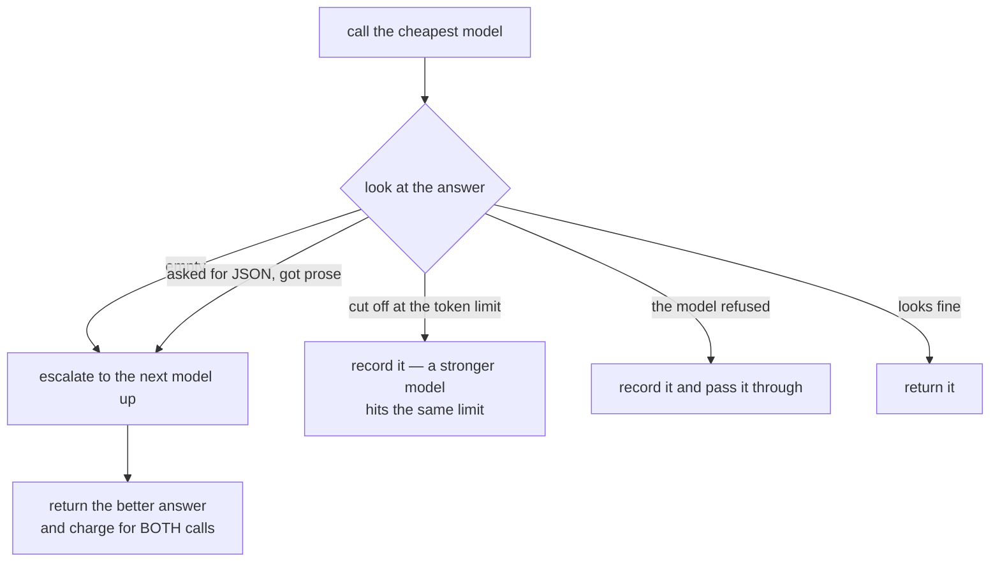
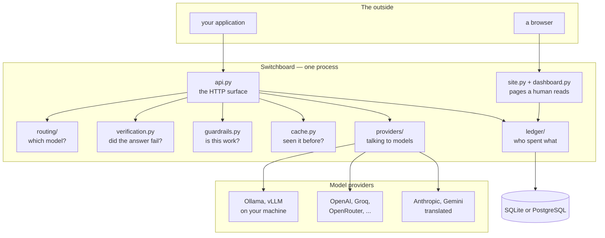
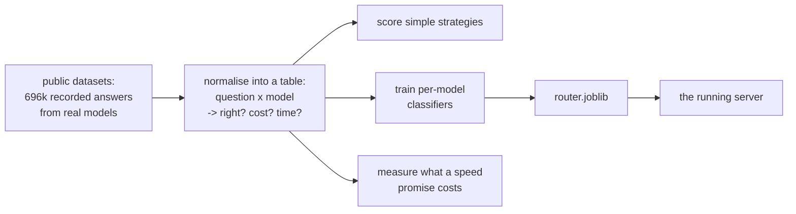

# How Switchboard works

This explains the whole system in plain English: what each piece does, why it
exists, and what happens to a single request from the moment it arrives.

No prior knowledge assumed. Every term is explained the first time it appears.

---

## 1. What it is, in one paragraph

You have an application that talks to an AI model. Switchboard sits in the
middle. Your application sends its request to Switchboard instead of to the
model provider; Switchboard decides **which** model should answer, sends it
there, and writes down what happened.



The only change in your application is the address it points at:

```python
# before
client = OpenAI(api_key="sk-...")

# after — one line
client = OpenAI(base_url="http://localhost:8000/v1", api_key="sk-switchboard-...")
```

Everything else — streaming, tools, whatever your library supports — keeps
working, because Switchboard passes your request through untouched and only ever
rewrites which model is named in it.

---

## 2. Why bother

Models differ in price by a factor of two hundred. Most questions do not need
the expensive one — but nobody can tell which, so in practice everything goes to
the expensive one and the bill is enormous.

Three things make that worth fixing, and only the third is hard:

| | |
|---|---|
| **Most requests don't need the best model** | "format this JSON" and "prove this theorem" go to the same place |
| **Price does not predict quality** | measured: two flagship models score identically while one costs twice as much |
| **Nobody can tell which is which in advance** | this is the actual problem |

---

## 3. What happens to one request

The order below is deliberate: **every step that can refuse a request happens
before any model is called**, so a refused request costs nothing.



Written out:

1. **Who is this?** The API key is hashed and looked up. Unknown key → `401`.
2. **Are they going too fast?** A monthly budget cannot stop a runaway script
   spending it in ninety seconds; a per-minute limit can. Too fast → `429`.
3. **Which model?** See section 4.
4. **Is this work?** The usage policy labels personal-looking requests. By
   default it labels and serves them; it can be set to refuse with `403`.
5. **Can they afford it?** Over budget → `402`. Recorded, and charged nothing.
6. **Have we answered this exact question before?** If so, return the stored
   answer, recorded as costing **zero**.
7. **Call the model.** Retry temporary failures, fail over to a backup provider.
8. **Look at the answer.** See section 5.
9. **Write it all down**, including what this would have cost on the most
   expensive model — which is what makes the savings figure checkable.

---

## 4. How a model gets chosen

This is the part that changed most during the project, and the reason is worth
knowing: **two experiments showed that a prompt cannot reliably be judged before
it is answered.** (Details in [RESULTS.md](RESULTS.md) sections 6 and 8.)

So there are three ways to choose, and the best available one wins:



### Tier 1 — your own router

Trained on your own traffic, from ratings your application sends back. It knows
your prompts and your exact model names. Best, but it needs traffic first.

### Tier 2 — the shipped router

Trained by us across 40 public benchmark suites and bundled inside the package,
so a fresh install has one immediately. It learned **which model suits which
kind of question** — reasoning, code and maths well; commonsense, emotion and
creative writing not at all. `switchboard router info` prints the full table.

### Tier 3 — the ladder

No prediction at all. It applies only facts:

- the cheapest model on your list, always
- unless the prompt does not fit that model's context window (a hard limit, not
  an opinion)
- unless the caller asked for a cost or speed cap

**It deliberately sends "hi" and "prove this theorem" to the same model.** There
is a test asserting that, because guessing from wording was measured and found
to be *worse than useless*: a hand-written keyword rule scored 77.8% on one
benchmark and 57.9% on another — worse than always using the cheapest model.

### Saying "I don't know"

The tier-2 router does not always have an opinion. When its confidence scores
for every model come out about the same, it has not distinguished them — and
acting on that difference would be inventing a decision. So it abstains, hands
over to the ladder, and says so in the record:

```
predictions span only 0.021 across 4 models - no usable discrimination
on this prompt, so no routing decision was made; ladder chose qwen2.5:1.5b
```

This exists because of a real failure. An earlier router returned 0.67–0.87 for
*every* model on unfamiliar prompts, sent everything to the cheapest one, and
wrote a reason implying a judgement had been made. It was not wrong — it was
**silent about knowing nothing**, which is worse, because nothing in the logs
said so.

---

## 5. Checking the answer afterwards

Guessing beforehand needs knowledge of the world. **Checking afterwards needs
only the answer, which is right there.** So the quality judgement happens after
the call, mechanically and for free.



The rule underneath: **a check may only trigger an escalation if escalating
would actually fix the problem.** Three of the five deliberately do not.

| Check | Escalates? | Why |
|---|---|---|
| empty response | **yes** | another model may well produce content |
| invalid JSON when JSON was asked for | **yes** | stronger models follow formats better |
| cut off at the token limit | no | a stronger model hits the same limit — raise the limit instead |
| **the model refused** | **never** | see below |
| hedging ("I'm not sure") | no | that may be the correct answer |

**A refusal is never escalated.** If a model declines a request, sending it up
the ladder until one complies is *shopping for a yes*. Switchboard records the
refusal and passes it through.

Default is to **check and record only**. Escalation makes a second call, which
doubles the cost of the requests it touches, and nobody should get a bigger bill
by installing software and leaving the defaults alone.

**An escalated request is charged for both calls.** Charging only for the model
that produced the final answer would make the feature look free.

---

## 6. The parts



None of this is a microservice. It is **one Python process**. The boxes are
files, and they are separate files because each one is a decision that can be
got wrong on its own.

### `api.py` — the front door

Implements the endpoints. One decision shaped everything else: **the request
body is not validated.** It is passed through as it arrived and only the model
name is ever rewritten.

Validating would mean modelling every feature the provider supports — tools,
response formats, whatever ships next month — and anything unmodelled would
break. Passing through means Switchboard works with features it has never heard
of.

### `routing/` — choosing a model

- `ladder.py` — the no-training policy. Cheapest model that fits.
- `live.py` — drives a trained router, applies per-request limits, and abstains
  when it has no opinion.
- `predictor.py`, `features.py` — turning a question into numbers, and one
  classifier per model. **These live in the shipped package on purpose**; see
  the note in section 9.
- `artifact.py` — saving and loading a trained router, with a readable sidecar
  describing what it was trained on.

A broken or missing router **never** stops the server. It falls back a tier and
`/health` says why.

### `verification.py` — was the answer obviously broken

Section 5. Pure string checks over a response already in memory: no model is
called, nothing is scored, no measurable delay.

It catches obvious failure, never wrongness. A fluent, confident, completely
incorrect answer passes every check — and that is the boundary of what can be
known without a human, stated wherever the numbers appear.

### `guardrails.py` — is this work

Notices when a company gateway is being used to plan somebody's holiday.

Shaped by one asymmetry: missing a personal request costs a fraction of a cent;
wrongly blocking a real one stops an engineer working. So it labels rather than
blocks, technical-looking content *subtracts* from the score, and
`switchboard guardrails calibrate` reports its own false-positive rate including
the exact prompts it got wrong.

It stores the verdict and which rules matched — **never the prompt text**. A
feature built to police what people type must not become the reason a company
starts recording what people type.

### `cache.py` — never pay twice

An in-memory store with a size limit and an expiry. Two rules:

- **Only byte-identical requests hit.** "Similar" is not matched. A cache that
  confidently answers a question nobody asked is worse than no cache.
- **A hit is recorded as costing zero**, because it did. Billing it at full
  price would inflate every savings figure in the product.

### `providers/` — talking to models

- `openai_compatible.py` — covers most of the industry, because most of the
  industry copied OpenAI's request format.
- `anthropic.py`, `gemini.py` — the two that did not. These **translate** in
  both directions, so your application only ever speaks one format.
- `pool.py` — holds the connections, knows which provider serves which model.
- `retry.py` — retries *temporary* failures only. A malformed request is never
  retried; it would fail identically and cost twice.
- `breaker.py` — after several failures a provider is skipped for a while, then
  probed. Without it, every request to a dead provider waits out its full
  timeout before failing over.

Failover rule: a provider that crashes or returns a server error is retried
elsewhere. **A "your request is wrong" error is not** — every other provider
would reject it identically, so trying them all just multiplies the cost of one
bad request.

### `ledger/` — who spent what

Two tables. People, and one row per request.

Every row stores what that request **would have cost on the most expensive
model**, which is what makes "we saved 57%" a database query rather than a
reconstruction from assumptions.

Only the hash of an API key is stored. The real key exists once, at creation,
and is never recoverable.

### `training.py` — learning from your own traffic

A benchmark comes with an answer key, so training on one is free. Real traffic
has none — nobody wrote down the correct response to "why is this test flaky".

So every response carries a request id, and your application sends back a
verdict:

```
POST /v1/feedback   {"request_id": "kJ8fQ2...", "rating": "bad"}
```

That is what a thumbs up/down in your interface calls.

**No label is ever inferred.** Guessing from behaviour ("they asked again, so it
was wrong") is cheap and wrong often enough to matter — and a wrong label does
not error, it quietly teaches the router something false.

Training refuses below its thresholds: prompt storage on, 30 rated requests per
model, at least 5 of each verdict, and 2 models clearing both.

### `paths.py` — where files live

Three kinds of file, three places:

| | |
|---|---|
| shipped data, read-only | inside the package |
| your config | a config directory |
| your data | a data directory |

Detected rather than configured: if a `providers.yaml` sits next to the package
that is a deliberate layout (a git checkout, or the Docker image) and everything
stays there. Otherwise it is a pip install, and the operating system's own
directories are used.

It also loads `.env` into the environment, which is how provider API keys reach
the code that reads them.

### `site.py` and `dashboard.py` — pages for humans

Server-rendered HTML with the styling inside the page. No JavaScript framework,
no build step, nothing loaded from anyone else's server.

Three reasons, in order: it has to work on a machine with no internet; a page
that needs a build step stops working in a year; and nothing loaded from a
content network should get to see when your engineers check their AI spend.

---

## 7. Where the money numbers come from

Every model has a price per million tokens in and out. After each request:

```
cost      = (input tokens x input price) + (output tokens x output price)
baseline  = the same tokens priced at your most expensive model
saved     = baseline - cost
```

Both numbers are stored **per row**, so any total is a query.

**Local models are priced, not free.** A model running on your own machine costs
nothing — but then every budget would be measured against zero, and zero is easy
to stay under. So each local model wears the price tag of the commercial model
it stands in for, which makes budgets and savings meaningful. Every screen that
shows money says "simulated pricing" plainly.

---

## 8. The research half

Everything under `eval/` is offline analysis. It is **not** in the Docker image
and is not needed to run the gateway.



The trick is that those datasets contain **answers real commercial models
already gave**. Once arranged into a table of question × model → (right?, cost,
time), any routing rule can be scored exactly — offline, with no API calls and
no spend. That is how a project with no budget produced numbers about GPT-5,
Claude and Gemini.

Test splits are **by question**, never by row, so the same question cannot
appear in both training and testing under two different models.

---

## 9. Rules that shaped everything

**Safe by default, useful on request.** Prompt storage off. Blocking off.
Escalation off. Local-only available. Nobody should acquire a legal liability or
a larger bill by installing software and leaving the defaults alone.

**Never flatter the numbers.** Cache hits cost zero. Escalations are charged for
both calls. Refused requests cost zero. Shadow-mode figures are labelled as
projections. Speed is judged by the bad days, not the typical day. Each of those
is a place where the self-serving version of the accounting would have looked
better.

**A degraded feature must not take the service down.** No router: fall back a
tier and say so. Provider down: fail over. Stale artifact: refuse it with a
message saying to retrain. The one exception is a broken *policy* file, which is
fatal at startup — a policy an operator believes is running must never be
silently off.

**Every decision records its reason.** The routing reason, which guardrail rules
matched, whether the cache hit, how many attempts were made. A gateway you
cannot interrogate afterwards is one nobody will trust with real traffic.

**Anything a trained artifact refers to must ship with the server.** Learned the
hard way: a saved router records which file its classes came from, and those
classes lived in `eval/`, which the Docker image deliberately does not copy. So
inside a container no trained router could load *at all*. The failure was caught
safely, routing switched itself off, and the health endpoint said "no router
artifact loaded" with nothing pointing at the cause.

---

## 10. Where the numbers are

[RESULTS.md](RESULTS.md) has every measured figure, the command that produces
it, and — for each one — what it does **not** prove. Including the two
experiments that failed and the approach they killed.
